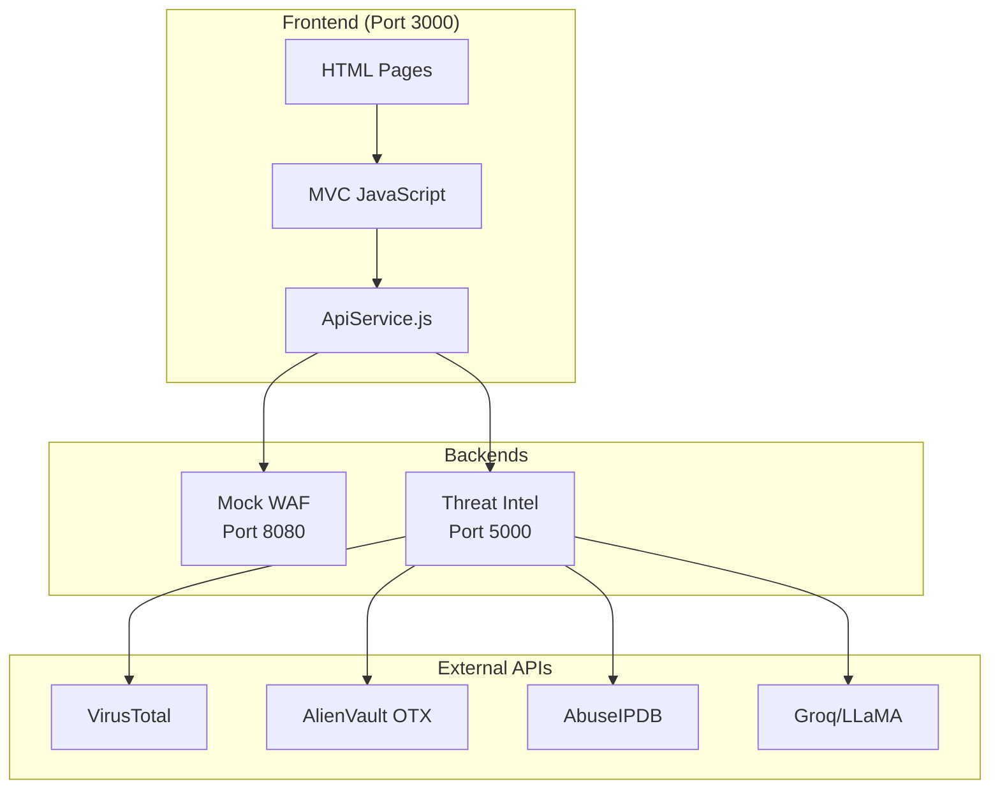

# WebHydra Frontend Dashboard

A modern web-based dashboard for WebHydra WAF (Web Application Firewall) built with MVC architecture. This frontend provides a comprehensive interface to monitor threats, view logs, manage rules, and analyze security events.

> ✅ **Fully Windows Compatible** - Works on Windows 10/11, Linux, and macOS. See [Windows-Specific Quick Start](#windows-specific-quick-start) for the fastest way to get started on Windows.

## Table of Contents

- [Features](#features)
- [Prerequisites](#prerequisites)
- [Installation](#installation)
- [Setup & Configuration](#setup--configuration)
- [Running the Application](#running-the-application)
- [Architecture](#architecture)
- [Default Credentials](#default-credentials)
- [API Integration](#api-integration)
- [Browser Compatibility](#browser-compatibility)
- [Troubleshooting](#troubleshooting)

## Features

- **Dashboard**: Overview of KPIs, traffic charts, and recent alerts
- **Threat Monitor**: Real-time anomaly detection and heatmap visualization
- **Threat Intelligence**: External threat feeds and intelligence
- **Rules & Policies**: Manage WAF rules and policies
- **Logs**: View and filter security logs with pagination
- **Learning Loop**: Retrain ML models with dataset upload
- **Recommendations**: AI-powered security recommendations
- **User Management**: Manage users and roles (Admin only)
- **Settings**: Configure API keys and preferences

## Prerequisites

### System Requirements

- **Operating System**: 
  - **Windows 10/11** (fully supported) ✅
  - Windows Server 2016+
  - Linux (Ubuntu 18.04+, Debian 10+, CentOS 7+)
  - macOS 10.14+
  - Any system with a modern web browser

- **Web Browser** (one of the following):
  - Google Chrome 90+ (recommended)
  - Mozilla Firefox 88+
  - Microsoft Edge 90+
  - Safari 14+
  - Opera 76+

### Software Requirements

1. **Python 3.6+** (for local development server)
   - **Windows**: Check installation: `python --version` or `py --version`
   - **Linux/macOS**: Check installation: `python3 --version`
   - Download: https://www.python.org/downloads/
   - **Windows Note**: During installation, check "Add Python to PATH" option

2. **Node.js 14+** (optional, for alternative server)
   - Check installation: `node --version`
   - Download: https://nodejs.org/

3. **Web Server** (optional, for production)
   - Apache 2.4+
   - Nginx 1.18+
   - Or any static file server

### Backend Requirements (Optional)

- **WebHydra Backend API** running on `http://127.0.0.1:8080/api`
  - If backend is unavailable, the frontend will use mock data
  - See [API Integration](#api-integration) for configuration

### Network Requirements

- **Internet Connection**: Required for CDN resources (Tailwind CSS, Chart.js, Feather Icons)
- **Port Availability**: 
  - Port 3000 (default for Python HTTP server)
  - Port 8080 (for backend API, if running locally)

## Installation

### Step 1: Clone or Download the Project

**Windows (Command Prompt or PowerShell):**
```cmd
# If using git
git clone <repository-url>
cd "WEB HYDRA Website"

# Or download and extract the ZIP file to a folder
# Navigate to the extracted folder
```

**Windows (PowerShell):**
```powershell
# If using git
git clone <repository-url>
cd "WEB HYDRA Website"

# Or download and extract the ZIP file
```

**Linux/macOS:**
```bash
# If using git
git clone <repository-url>
cd "WEB HYDRA Website"

# Or download and extract the ZIP file
```

**Windows Path Notes:**
- If your folder name contains spaces (like "WEB HYDRA Website"), use quotes: `cd "WEB HYDRA Website"`
- Use backslashes `\` in Command Prompt or forward slashes `/` in PowerShell

### Step 2: Verify File Structure

Ensure you have the following directory structure:

```
WEB HYDRA Website/
├── assets/
│   ├── app-mvc.js
│   ├── style.css
│   └── images/
├── controllers/
├── models/
├── views/
├── services/
├── utils/
├── data/
│   └── mock-data.js
├── partials/
│   └── sidebar.html
└── *.html files
```

### Step 3: No Build Step Required

This is a **vanilla JavaScript** project with no build process required. All dependencies are loaded via CDN.

## Setup & Configuration

### API Configuration

The frontend connects to the WebHydra backend API. To change the API URL, edit `services/ApiService.js`:

```javascript
// services/ApiService.js
class ApiService {
  constructor(baseURL = 'http://127.0.0.1:8080/api') {
    this.baseURL = baseURL;  // Change this to your backend URL
  }
  // ...
}
```

### Environment Setup

No environment variables or configuration files are required. The application uses:
- **localStorage** for user authentication and preferences
- **CDN** for external libraries (no npm install needed)

## Running the Application

### Option 1: Python HTTP Server (Recommended for Development)

**Windows (Command Prompt):**
```cmd
# Navigate to project directory
cd "C:\path\to\WEB HYDRA Website"

# Start Python HTTP server
python -m http.server 3000

# Or if python doesn't work, try:
py -m http.server 3000
```

**Windows (PowerShell):**
```powershell
# Navigate to project directory
cd "C:\path\to\WEB HYDRA Website"

# Start Python HTTP server
python -m http.server 3000

# Or if python doesn't work, try:
py -m http.server 3000
```

**Linux/macOS:**
```bash
# Navigate to project directory
cd "WEB HYDRA Website"

# Start Python HTTP server
python3 -m http.server 3000
```

Then open your browser and navigate to:
```
http://localhost:3000
```

**Windows Firewall Note:** If Windows Firewall prompts you, click "Allow access" to allow Python to accept connections.

### Option 2: Node.js HTTP Server

**Windows (Command Prompt or PowerShell):**
```cmd
# Install http-server globally (one-time)
npm install -g http-server

# Navigate to project directory
cd "WEB HYDRA Website"

# Start server
http-server -p 3000
```

**Linux/macOS:**
```bash
# Install http-server globally (one-time)
npm install -g http-server

# Navigate to project directory
cd "WEB HYDRA Website"

# Start server
http-server -p 3000
```

**Windows Note:** If you get a permission error, run Command Prompt or PowerShell as Administrator.

### Option 3: PHP Built-in Server

**Windows:**
```cmd
cd "WEB HYDRA Website"
php -S localhost:3000
```

**Linux/macOS:**
```bash
cd "WEB HYDRA Website"
php -S localhost:3000
```

**Windows Note:** PHP is not included by default on Windows. Download from https://windows.php.net/download/

### Option 4: Production Web Server

#### Windows IIS (Internet Information Services)

1. Install IIS from Windows Features (Control Panel → Programs → Turn Windows features on/off)
2. Copy project files to `C:\inetpub\wwwroot\` or create a new site
3. Configure IIS to serve static files
4. Access via `http://localhost/` or your configured domain

#### Apache Configuration

**Windows:**
1. Install Apache from https://httpd.apache.org/download.cgi
2. Copy project files to Apache document root (e.g., `C:\Apache24\htdocs\`)
3. Configure virtual host in `httpd.conf`
4. Access via `http://localhost/`

**Linux:**
1. Copy project files to Apache document root (e.g., `/var/www/html/`)
2. Ensure `.htaccess` allows directory browsing or configure virtual host
3. Access via `http://your-domain/`

#### Nginx Configuration

**Windows:**
1. Download Nginx from https://nginx.org/en/download.html
2. Extract and configure `nginx.conf`
3. Set `root` to your project directory: `root C:/path/to/WEB HYDRA Website;`
4. Access via `http://localhost/`

**Linux:**
```nginx
server {
    listen 80;
    server_name your-domain.com;
    root /path/to/WEB HYDRA Website;
    index index.html;

    location / {
        try_files $uri $uri/ =404;
    }
}
```

### Option 5: VS Code Live Server

1. Install "Live Server" extension in VS Code
2. Right-click on `index.html`
3. Select "Open with Live Server"

## Architecture

This project uses **MVC (Model-View-Controller)** architecture. See [MVC-ARCHITECTURE.md](./MVC-ARCHITECTURE.md) for detailed documentation.

### Quick Overview

- **Models** (`models/`): Data management and business logic
- **Views** (`views/`): UI rendering and DOM manipulation
- **Controllers** (`controllers/`): Coordinate models and views
- **Services** (`services/`): External services (API, Storage)
- **Utils** (`utils/`): Utility functions and constants

## Default Credentials

### Login Credentials

- **Admin Account**:
  - Username: `admin`
  - Password: `admin123`
  - Access: Full access to all features

- **Viewer Account**:
  - Username: `user`
  - Password: `user123`
  - Access: Read-only access to dashboards and logs

### User Roles

- **Admin**: Full access, can manage users, rules, and settings
- **Operator**: Can manage rules, view logs and threats
- **Analyst**: Read-only access to most features, can view learning loops
- **Viewer**: Read-only access to dashboards, threats, and logs

## API Integration

The frontend automatically fetches data from the WebHydra backend API:

| Endpoint | Description |
|----------|-------------|
| `/api/kpis` | Dashboard KPIs (total requests, blocked attacks, etc.) |
| `/api/logs` | Security logs with pagination |
| `/api/alerts` | Recent security alerts |
| `/api/traffic` | Traffic data for charts |
| `/api/owasp` | OWASP threat distribution |
| `/api/heatmap` | Anomaly heatmap data |

### Fallback Behavior

If the backend API is unavailable:
- The frontend automatically falls back to mock data
- All features remain functional for demonstration
- No errors are displayed to users

### CORS Configuration

Ensure your backend API has CORS enabled to allow frontend connections:

```python
# Example for Flask
from flask_cors import CORS
CORS(app, origins=["http://localhost:3000"])
```

## Browser Compatibility

### Supported Browsers

| Browser | Minimum Version | Status |
|---------|----------------|--------|
| Chrome | 90+ | ✅ Fully Supported |
| Firefox | 88+ | ✅ Fully Supported |
| Edge | 90+ | ✅ Fully Supported |
| Safari | 14+ | ✅ Fully Supported |
| Opera | 76+ | ✅ Fully Supported |

### Required Browser Features

- **ES6+ JavaScript** (Classes, Arrow Functions, Async/Await)
- **localStorage API** (for authentication and preferences)
- **Fetch API** (for API calls)
- **Canvas API** (for chart rendering)

### Browser Settings

- **JavaScript**: Must be enabled
- **Cookies**: Required for session management
- **Local Storage**: Required for user preferences

## Troubleshooting

### Common Issues

#### 1. Page Not Loading / Blank Screen

**Problem**: JavaScript errors preventing page load

**Solutions**:
- Open browser Developer Tools (F12)
- Check Console tab for errors
- Verify all script files are loading (Network tab)
- Ensure you're using a supported browser version

#### 2. API Connection Errors

**Problem**: Cannot connect to backend API

**Solutions**:
- Verify backend is running on `http://127.0.0.1:8080`
- Check CORS settings on backend
- Verify API URL in `services/ApiService.js`
- Frontend will use mock data if API unavailable

#### 3. Login Not Working

**Problem**: Cannot log in or redirected to login page

**Solutions**:
- Clear browser localStorage: `localStorage.clear()` in console
- Use default credentials (admin/admin123)
- Check browser console for errors
- Verify JavaScript is enabled

#### 4. Charts Not Displaying

**Problem**: Charts appear blank

**Solutions**:
- Check internet connection (CDN resources needed)
- Verify Chart.js is loading (Network tab)
- Check browser console for errors
- Try refreshing the page

#### 5. Sidebar Not Loading

**Problem**: Sidebar appears empty

**Solutions**:
- Check `partials/sidebar.html` exists
- Verify file permissions
- Check browser console for fetch errors
- Fallback sidebar should load automatically

#### 6. Port Already in Use

**Problem**: `Address already in use` error

**Solutions - Windows:**

**Command Prompt:**
```cmd
# Find process using port 3000
netstat -ano | findstr :3000

# Note the PID (last column), then kill it
taskkill /PID <PID> /F

# Or use a different port
python -m http.server 3001
```

**PowerShell:**
```powershell
# Find process using port 3000
Get-NetTCPConnection -LocalPort 3000 | Select-Object OwningProcess

# Kill the process (replace <PID> with actual PID)
Stop-Process -Id <PID> -Force

# Or use a different port
python -m http.server 3001
```

**Linux/macOS:**
```bash
# Find process using port 3000
lsof -i :3000

# Kill the process or use a different port
python3 -m http.server 3001
```

#### 7. Windows-Specific Issues

**Problem**: `'python' is not recognized as an internal or external command`

**Solutions**:
- Reinstall Python and check "Add Python to PATH" during installation
- Or use `py` command instead: `py -m http.server 3000`
- Or add Python to PATH manually:
  1. Search "Environment Variables" in Windows
  2. Edit "Path" variable
  3. Add Python installation directory (e.g., `C:\Python39\`)

**Problem**: Windows Firewall blocking connections

**Solutions**:
- When prompted, click "Allow access" for Python/Node.js
- Or manually add exception in Windows Firewall settings
- Go to: Control Panel → Windows Defender Firewall → Allow an app

**Problem**: Long path names causing issues

**Solutions**:
- Move project to a shorter path (e.g., `C:\webhydra\`)
- Enable long path support in Windows 10/11:
  1. Run `gpedit.msc` (Group Policy Editor)
  2. Navigate to: Computer Configuration → Administrative Templates → System → Filesystem
  3. Enable "Enable Win32 long paths"

**Problem**: PowerShell execution policy blocking scripts

**Solutions**:
```powershell
# Check current policy
Get-ExecutionPolicy

# Set policy for current user (if needed)
Set-ExecutionPolicy -ExecutionPolicy RemoteSigned -Scope CurrentUser
```

### Getting Help

1. Check browser console for errors (F12 → Console)
2. Verify all prerequisites are installed
3. Review [MVC-ARCHITECTURE.md](./MVC-ARCHITECTURE.md) for architecture details
4. Check network tab for failed requests

## Development Notes

- **Auto-refresh**: Dashboard refreshes every 30 seconds
- **Logs refresh**: Every 10 seconds
- **Mock data**: Located in `data/mock-data.js`
- **Theme**: Dark mode by default, toggleable via topbar
- **Responsive**: Mobile-friendly design with Tailwind CSS

## Windows-Specific Quick Start

**Fastest way to run on Windows:**

1. **Download Python** from https://www.python.org/downloads/
   - ✅ Check "Add Python to PATH" during installation

2. **Open Command Prompt** (Win + R, type `cmd`, Enter)

3. **Navigate to project folder:**
   ```cmd
   cd "C:\path\to\WEB HYDRA Website"
   ```

4. **Start server:**
   ```cmd
   python -m http.server 3000
   ```

5. **Open browser** and go to: `http://localhost:3000`

6. **Login** with:
   - Username: `admin`
   - Password: `admin123`

**Alternative: Double-click method (Windows)**

A `start.bat` file is already included in the project root! Simply:

1. **Double-click `start.bat`** in Windows Explorer
2. A command window will open and start the server
3. Open your browser to `http://localhost:3000`

The batch file automatically:
- Checks if Python is installed
- Uses the correct Python command (`python` or `py`)
- Starts the server on port 3000
- Shows helpful error messages if Python is missing

**Note:** If Windows shows a security warning, click "More info" → "Run anyway" (the batch file is safe and only starts a local server).

## License

[Add your license information here]

## Contributing

[Add contribution guidelines here]

---

# Project Analysis & Improvements Walkthrough

## Overview

This section summarizes the comprehensive analysis and improvements made to the WebHydra WAF Dashboard project.

---

## Project Structure

```
WEB HYDRA Website/
├── assets/           # CSS, JS, images
│   ├── app-mvc.js    # Main MVC entry point
│   ├── test.js       # [NEW] WAF Test Suite logic
│   └── style.css
├── backend/          # Python Flask backends
│   ├── app.py        # Threat Intelligence API (port 5000)
│   ├── waf_mock.py   # [NEW] Mock WAF API (port 8080)
│   └── services/
├── controllers/      # MVC Controllers
├── models/           # MVC Models
├── views/            # MVC Views
├── services/         # Frontend services (API, Storage)
├── utils/            # Helpers and constants
└── *.html            # Page templates
```

---

## Issues Found & Fixed

### 🐛 Critical Bugs

| Issue | Location | Fix |
|-------|----------|-----|
| Missing `test.js` file | `test.html:260` referenced non-existent file | Created `assets/test.js` with full WAF test functionality |
| Duplicate script loading | `test.html:244-246` loaded `mock-data.js` twice | Removed duplicate |
| Python import error | `backend/app.py:12` used wrong import path | Changed to relative import |

### ⚠️ Security Concerns (Noted, Not Fixed)

| Issue | Location | Note |
|-------|----------|------|
| Plaintext passwords in localStorage | `models/UserModel.js` | Demo/dev only; needs hashing for production |
| No session expiry | `StorageService.js` | Users stay logged in forever |

---

## New Features Added

### 1. WAF Test Suite (`assets/test.js`)

Full implementation of the WAF Test Suite page:

- **4 predefined test cases** (PROXY malicious/safe, ML malicious/safe)
- **"Run All Tests" button** executes tests sequentially with UI feedback
- **Individual test buttons** for each test card
- **Traffic Simulator** generates random requests every second
- **Graceful fallback** when WAF is offline (shows simulated results)
- **Real-time stats** counter (total/blocked/allowed)

### 2. Health Check Indicators

Added backend connectivity monitoring to the topbar:

| Indicator | Description |
|-----------|-------------|
| 🟢 WAF | Green when port 8080 responds |
| 🔴 WAF | Red when port 8080 is unreachable |
| 🟢 TI | Green when port 5000 responds |
| 🔴 TI | Red when port 5000 is unreachable |

**Files modified:**
- `services/ApiService.js` — Added `checkWAFHealth()`, `checkTIHealth()`, `checkAllHealth()`
- `utils/helpers.js` — Added `initHealthCheck()` method
- `assets/app-mvc.js` — Added call to `Helpers.initHealthCheck()`

### 3. Mock WAF Backend (`backend/waf_mock.py`)

A complete simulation of the WAF API on port 8080:

| Endpoint | Description |
|----------|-------------|
| `GET /api/health` | Health check |
| `GET /api/kpis` | Dashboard KPIs |
| `GET /api/alerts` | Security alerts |
| `GET /api/traffic` | Traffic chart data |
| `GET /api/owasp` | OWASP threat distribution |
| `GET /api/heatmap` | Anomaly heatmap |
| `GET /api/logs` | Paginated logs |
| `GET /api/stats` | General statistics |
| `GET /search` | Test endpoint (blocks SQLi) |
| `POST /api/data` | Test endpoint (blocks patterns) |
| `POST /api/submit` | Test endpoint (allows normal data) |

---

## Running the Full System

### Quick Start (Windows)

Double-click `start_all.bat` in the project root — it launches all three servers and opens the browser!

### Manual Start

```powershell
# Terminal 1: Frontend
cd "WEB HYDRA Website"
python -m http.server 3000

# Terminal 2: Threat Intelligence Backend
cd "WEB HYDRA Website/backend"
python app.py

# Terminal 3: Mock WAF Backend
cd "WEB HYDRA Website/backend"
python waf_mock.py
```

### Access Points

| Service | URL |
|---------|-----|
| Login | http://localhost:3000/login.html |
| Dashboard (Admin) | http://localhost:3000/admin.html |
| Dashboard (User) | http://localhost:3000/user.html |
| WAF Test Suite | http://localhost:3000/test.html |

### Default Credentials

| Username | Password | Role |
|----------|----------|------|
| admin | admin123 | Admin (full access) |
| user | user123 | Viewer (read-only) |

---

## Verification Results

| Feature | Status | Notes |
|---------|--------|-------|
| Login flow | ✅ Works | Redirects based on role |
| Dashboard KPIs | ✅ Works | Live data from mock WAF |
| Traffic charts | ✅ Works | Line chart renders correctly |
| OWASP donut chart | ✅ Works | With hover tooltips |
| Alerts table | ✅ Works | Auto-refreshes every 30s |
| Logs page | ✅ Works | Filtering and pagination |
| WAF Test Suite | ✅ Works | All 4 tests pass |
| Traffic Simulator | ✅ Works | Generates random requests |
| Health indicators | ✅ Works | Both show green when backends run |
| Threat Intelligence | ✅ Works | Feeds load, lookups work |
| Theme toggle | ✅ Works | Dark/light mode |
| Logout | ✅ Works | Clears session |

---

## Architecture Diagram



---

## Next Steps (Recommendations)

1. **Replace Mock WAF** — Integrate actual WAF engine (ModSecurity, custom Go/Rust binary)
2. **Add Authentication JWT** — Replace localStorage tokens with proper JWT
3. **Database Integration** — Replace in-memory caching with SQLite/PostgreSQL
4. **Unit Tests** — Add Jest tests for frontend, pytest for backend
5. **Docker Compose** — Containerize all services for easy deployment

---

## Files Changed Summary

| File | Action | Description |
|------|--------|-------------|
| `assets/test.js` | Created | WAF Test Suite functionality |
| `backend/waf_mock.py` | Created | Mock WAF API server |
| `test.html` | Modified | Removed duplicate script |
| `backend/app.py` | Modified | Fixed import path |
| `services/ApiService.js` | Modified | Added health check methods |
| `utils/helpers.js` | Modified | Added health indicator |
| `assets/app-mvc.js` | Modified | Added health check initialization |

---

**Note**: For full functionality, ensure all three backends are running (Frontend on 3000, TI on 5000, WAF Mock on 8080). Use `start_all.bat` for convenience.
