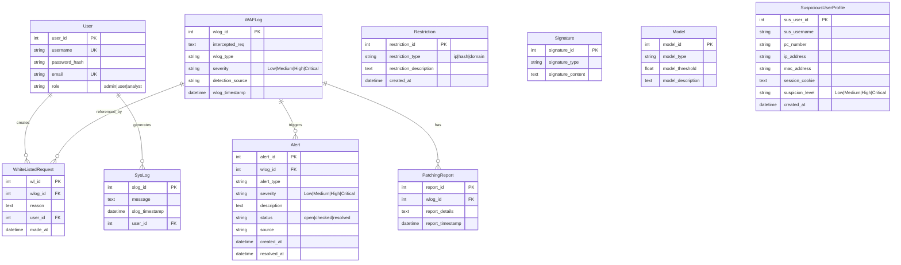

# HYDRA Database Entity Relationship Diagram

This document contains the ERD for the HYDRA WAF database schema.

## Entity Relationship Diagram

## Table Descriptions

### User
Stores system users with role-based access control (admin, user, analyst).

### WAFLog
Records all intercepted web requests with classification and severity information.

### Alert
Security alerts generated from WAF log entries requiring attention.

### Restriction
Blocked entities (IPs, hashes, domains) that are denied access.

### Signature
Attack patterns used by the signature-based detection engine.

### Model
AI/ML model configurations and thresholds.

### PatchingReport
Recommended actions and patches generated for detected threats.

### SuspiciousUserProfile
Profiles of users exhibiting suspicious behavior patterns.

### WhiteListedRequest
Previously flagged requests that have been manually approved.

### SysLog
System activity and audit logs.
